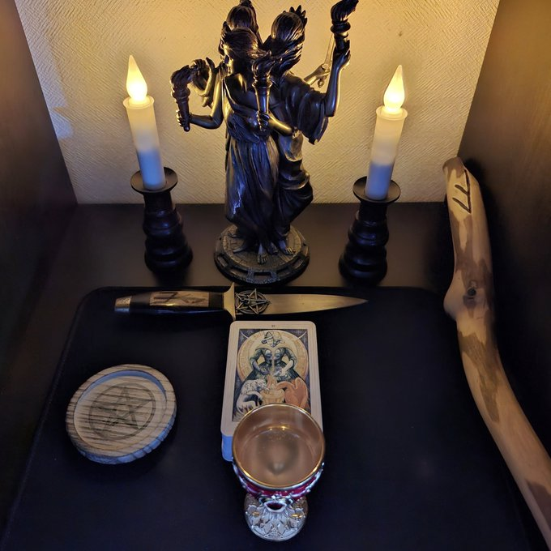

## 📚🔬 本棚神殿の作り方 v0.1

【概要】
本プロトコルは「自宅の本棚を利用して、簡易的な神殿を構築する方法」を提案するものです。心を整え、力を発生させる『祈りの空間』を自分専用の小さなエンジンのように構築しましょう。

---

## ① 本棚を片付ける

- 像やカードを並べるためのスペースを確保する
- 除菌アルコールなどで掃除をする、シンプルさを大切に

## ② シンボルを置く

- 推しの神や女神の像を置く
- 例：アテナ、エリス、ガネーシャ、黒い聖母、ケルヌンノス、ポップカルチャーのキャラクターなど自由に

## ③ 方角を合わせる

- コンパスやコンパスのアプリでおよその東西南北を確認します
- 本棚の奥に推しのフィギュアや銅像を置きます
- その前の空間に東西南北に対応した魔法武器を置きます：
  - アサメイ（東）
  - ワンド（南）
  - カップ（西）
  - ペンタクル（北）
- 電池式のそうろくを両端に置き、手前に香炉を置きます

## ④ 安全性

- ろうそくは火を使わず電池式のものを使う
- お香は火を使うので気をつけて、匂いについて家族などと相談しておく

---

## ✨ 神殿の聖別儀式 (ver.0.1)

電池式のろうそくを灯し、香を焚き、カップに水を注ぎます。アサメイで五芒星を空中に描き、次の文章を唱えます：

> By this act, I declare this space sacred.\
> Let it be a place of clarity, peace, and power. So mote it be.\
> 「私はこの儀式をもって、ここを聖なる場と宣言する。ここが明晰さ、平和、そして力の宿る場となるように。そうあれかし。」

終了後は水を入れた器を捧げて、祈り、終了します。

---

## 🌈 例：ヘカテ女神での本棚神殿

以下は「ヘカテ女神の本棚神殿」を構築し、タロットカードの聖別を行っている写真です。

女神像、電池式ろうそく、アサメイ、カップ、ペンタクル、タロットカードを配置しています。

---

今後、他の神々や女神をテーマにしたバリエーションも公開予定です。
